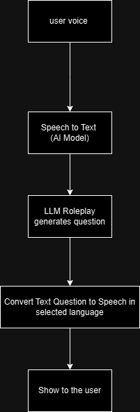

# AI-role-play-for-sales

## Architecture

This diagram represents the architecture of the system:




## Setup Instructions

### Step 1: Install Dependencies
Ensure you have all required dependencies installed. Run the following command to install packages from `requirements.txt`:

```bash
pip install -r requirements.txt
```

### Step 2: Launch the Streamlit App

```bash
streamlit run main.py
```

